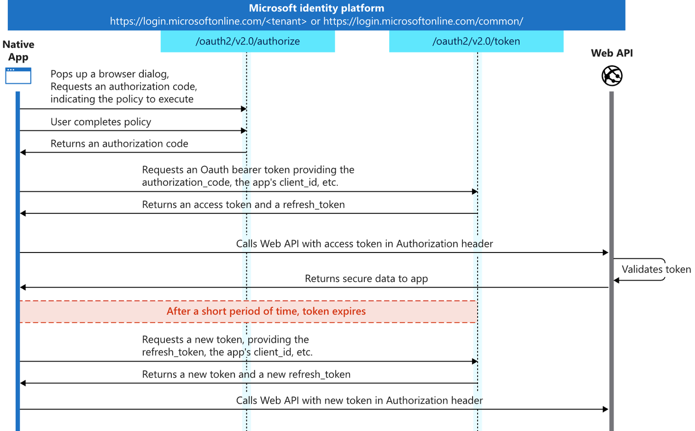

### objective

Terraform used to provision 2 App Registrations with settings to configure one as a Server and Client for OAuth2.0 operation. In addition, it configures an APIM to use the Server as the authorisation server to protect its resources.

Server: Resource authorisation server. Contains and OAuth scope which controls access to the resources.
CLient: Application authorized by the server to access the resource through the OAuth scope.

### About

This diagram shows a high-level view of the authentication flow. The instructions below will allow us to set a App Registration/Service Principal as a server to expose the API and a client to authenticate to the server and retrieve a token to access the exposed API. In the example below, postman will be used to get the token and call the API.



Instructions to enable OAuth 2.0 for APIM

1. Create App Registration for Server

App registration > New registration

Name = {PROJECT_NAME}-{prod/staging/dev}-001-server

Register

Go into registration’s manifest

Set accessTokenAcceptedVersion to 2.

Save

Go into Expose an API

Application ID URI > Set > Save

Add a scope

Scope name = Invoke.API

Admin consent display name = Invoke APIs

Admin content description = Invoke APIs

Add scope

2. Create App Registration for Client

App registration > New registration

Name = {PROJECT_NAME}-{prod/staging/dev}-001-client

Register

Go into registration’s manifest

Set accessTokenAcceptedVersion to 2.

Save

Go into API permissions > Add a permission > My APIs

Select the App Registration created for server

Select the Invoke.API permission

Add permissions

Go into API permissions > Grant admin consent … > Yes. This will grant the permission.

Go into Certificates & Secrets > New Client Secret

Description = Secret

Add

Save the Secret ID and Secret Value for use later

Go into Authentication > Add a platform > Web

(Optional: Only if you would like to get the token via postman) Redirect URIs = https://oauth.pstmn.io/v1/callback

[Jerome - Need to double check with Mathew if this is required for his team to get the access token as I am expecting this to redirect to whatever page they are calling this from] Redirect URIs = http://localhost

Return to the Server App Registration

Go into Expose an API > Add a client application

Client ID = {CLIENT_APP_REGISTRATION_CLIENT_ID}

Checked Authorized scopes option

3. In order to protect an API with OAuth 2.0, go into APIM

OAuth 2.0 + OpenID Connect > Add

Display Name = {PROJECT_NAME}-{prod/staging/dev}-001-service

Client registration page URL = https://localhost

Authorization Grant Type = Authorization code, Client credentials

Authorization endpoint URL = Client App Registration OAuth 2.0 authorization endpoint (v2)

Token endpoint URL = Client App Registration OAuth 2.0 token endpoint (v2)

Default Scope = api://{SERVER_APP_REGISTRATION_APPLICATION_ID}/API.Invoke

Client ID = (CLIENT_APP_REGISTRATION_CLIENT_ID)

Client secret = {CLIENT_APP_REGISTRATION_SECRET_VALUE}

APIs > Select the API you would like to add OAuth 2.0 to > Settings > Security

Select {PROJECT_NAME}-{prod/staging/dev}-001-service

Save

APIs > Select the API you would like to add OAuth 2.0 to > Inbound processing > Edit policy

```
<validate-jwt header-name="Authorization" failed-validation-httpcode="401" failed-validation-error-message="Unauthorized. Access token is missing or invalid." require-scheme="Bearer">
    <openid-config url="https://login.microsoftonline.com/{TENANT_ID}/v2.0/.well-known/openid-configuration" />
    <issuers>
        <issuer>https://sts.windows.net/{TENANT_ID}/</issuer>
    </issuers>
    <required-claims>
        <claim name="aud">
            <value>{SERVER_APP_REGISTRATION_CLIENT_ID}</value>
        </claim>
    </required-claims>
</validate-jwt>
```

4. Optional: Only required if you are using the APIM Developer Portal.) Copy and paste the OAuth 2.0 service redirect URI and paste it into the Client App Registration

Go into APIM > OAuth 2.0 + OpenID Connect > Select the just created OAuth 2.0 service

Scroll down and select Redirect URI (Note: If this does not work, try the URI in the deprecated portal. The error message would let you know.)

Copy the Authorization code grant flow

Return to the Client App Registration > Authentication > Add a platform > Web

Redirect URI = {Paste the OAuth 2.0 service redirect URI Authorization code grant flow}

5. In Postman, create a collection and request. Under either collection or request go to the Authorization tab > Select Type OAuth 2.0

Grant Type = Authorization Code

Callback URL = https://oauth.pstmn.io/v1/callback

Authorize using browser = enabled

Auth URL = Server App Registration OAuth 2.0 authorization endpoint (v2)

Access Token URL = Server App Registration OAuth 2.0 token endpoint (v2)

Client ID = {CLIENT_APP_REGISTRATION_CLIENT_ID}

Client Secret = {CLIENT_APP_REGISTRATION_SECRET_VALUE}

Scope = {SERVER_APP_REGISTRATION_API_PERMISSION_SCOPE}

Get New Access Token

Use the token to call the API
